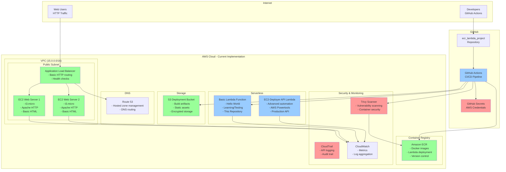

# EC2 Gaming Platform - Architecture Documentation

## A) Previous Gaming Platform Design (Original Vision)

```mermaid
graph TB
    subgraph "Internet"
        Users[Gaming Users<br/>Brothers & Family]
        Admin[Platform Admin]
    end
    
    subgraph "AWS Cloud - Gaming Platform"
        subgraph "Public Subnet"
            ALB[Application Load Balancer<br/>- HTTP/HTTPS Traffic<br/>- Health Checks]
            Bastion[Bastion Host<br/>- SSH Gateway<br/>- Family Access]
        end
        
        subgraph "Private Subnet"
            subgraph "Gaming Instances"
                Gaming1[EC2 Gaming Instance 1<br/>- GPU Optimized<br/>- Steam + Games<br/>- Windows/Linux]
                Gaming2[EC2 Gaming Instance 2<br/>- GPU Optimized<br/>- Steam + Games<br/>- Windows/Linux]
                Gaming3[EC2 Gaming Instance N<br/>- On-demand scaling<br/>- Per-user instances]
            end
            
            subgraph "Database Layer"
                RDS[(PostgreSQL/TimescaleDB<br/>- User Sessions<br/>- Game Progress<br/>- Billing Data)]
            end
        end
        
        subgraph "Storage Layer"
            S3Games[S3 Bucket - Game Files<br/>- Steam games<br/>- Save files<br/>- Driver packages]
            S3Saves[S3 Bucket - Save Games<br/>- User backups<br/>- Cross-instance sync]
            EBS[EBS Snapshots<br/>- Instance images<br/>- Quick restore]
        end
        
        subgraph "Serverless Layer"
            APILambda[Gaming API Lambda<br/>- Start/Stop instances<br/>- User management<br/>- Billing automation]
            WorkflowLambda[Workflow Lambda<br/>- Driver installation<br/>- Game deployment<br/>- Save game sync]
            BillingLambda[Billing Lambda<br/>- Weekly invoices<br/>- Venmo integration<br/>- Usage tracking]
        end
        
        subgraph "Automation"
            StepFunctions[Step Functions<br/>- Instance provisioning<br/>- Game installation<br/>- Teardown workflows]
            CloudWatch[CloudWatch<br/>- Cost monitoring<br/>- Usage alerts<br/>- Performance metrics]
        end
    end
    
    subgraph "External Services"
        Venmo[Venmo API<br/>- Payment requests<br/>- Weekly billing]
        Steam[Steam/SteamCMD<br/>- Game downloads<br/>- Library sync]
        Route53[Route 53<br/>- DNS management<br/>- Load balancing]
    end
    
    %% User Connections
    Users --> ALB
    Users --> Gaming1
    Users --> Gaming2
    Users --> Gaming3
    Admin --> Bastion
    
    %% Internal Connections
    ALB --> Gaming1
    ALB --> Gaming2
    ALB --> Gaming3
    Bastion --> Gaming1
    Bastion --> Gaming2
    Bastion --> Gaming3
    
    Gaming1 --> RDS
    Gaming2 --> RDS
    Gaming3 --> RDS
    
    Gaming1 --> S3Games
    Gaming2 --> S3Games
    Gaming3 --> S3Games
    
    Gaming1 --> S3Saves
    Gaming2 --> S3Saves
    Gaming3 --> S3Saves
    
    APILambda --> Gaming1
    APILambda --> Gaming2
    APILambda --> Gaming3
    APILambda --> RDS
    
    WorkflowLambda --> Gaming1
    WorkflowLambda --> Gaming2
    WorkflowLambda --> Gaming3
    WorkflowLambda --> S3Games
    WorkflowLambda --> S3Saves
    
    BillingLambda --> RDS
    BillingLambda --> Venmo
    
    StepFunctions --> APILambda
    StepFunctions --> WorkflowLambda
    StepFunctions --> BillingLambda
    
    CloudWatch --> APILambda
    CloudWatch --> WorkflowLambda
    CloudWatch --> BillingLambda
    
    Gaming1 --> Steam
    Gaming2 --> Steam
    Gaming3 --> Steam
    
    ALB --> Route53
    
    classDef gaming fill:#ff9999
    classDef serverless fill:#99ccff
    classDef storage fill:#99ff99
    classDef network fill:#ffcc99
    
    class Gaming1,Gaming2,Gaming3 gaming
    class APILambda,WorkflowLambda,BillingLambda,StepFunctions serverless
    class S3Games,S3Saves,EBS,RDS storage
    class ALB,Bastion,Route53 network
```

### Gaming Platform Features (Original Vision)

#### User APIs
- **Onboard User**: Create gaming profile, install user directory
- **Start Instance**: Boot up user's dedicated gaming instance
- **Launch Instance**: Provision new gaming hardware (admin/user)
  - v1: Single instance type (GPU-optimized)
  - v*: Multiple instance types based on game requirements
  - GPU rating comparison with EC2 instance capabilities
- **Install Games**: Automated Steam/SteamCMD game installation
- **Launch Games**: Direct game launching from platform
- **Stop Instance**: Hibernate/stop gaming session

#### Admin APIs
- **Offboard User**: Remove user profile and clean up resources
- **Terminate Instance**: Destroy gaming instance
- **Cost Management**: Weekly invoices, Venmo payment requests
- **Resource Monitoring**: Track usage, costs, performance

#### Automation Features
- **Driver Installation**: Automated GPU driver updates
- **Save Game Sync**: Backup saves to S3, restore on instance start
- **Instance Imaging**: Create AMIs when instances are stopped
- **Cost Optimization**: Auto-shutdown inactive instances
- **Multi-user Support**: Shared instances with user profiles

## B) Current Implementation Design (Actual State)

### Current Implementation Status

#### ✅ Working Components
- **Basic Lambda Function**: Hello World implementation with CI/CD
- **GitHub Actions Pipeline**: Automated deployment with security scanning
- **ECR Integration**: Containerized Lambda deployment
- **S3 Deployment**: Encrypted artifact storage
- **VPC Infrastructure**: Network foundation (separate repository)
- **Web Servers**: Basic Apache HTTP servers with ALB

#### ⚠️ Security Issues Identified
- **SSH Access**: Wide open (0.0.0.0/0) in security groups
- **Password Authentication**: Enabled instead of key-only
- **No Bastion Host**: Direct internet SSH access to instances
- **HTTP Only**: No HTTPS/TLS configuration
- **Credential Exposure**: Previously exposed in git history (now cleaned)

#### 📋 Missing Gaming Features
- **GPU Instances**: Currently using t3.micro (no GPU)
- **Game Installation**: No Steam/gaming software automation
- **User Management**: No multi-user gaming profiles
- **Billing System**: No cost tracking or payment integration
- **Save Game Sync**: No S3 backup/restore functionality
- **Database Layer**: No PostgreSQL/TimescaleDB for user data

## Comparison: Gaming Vision vs Current Reality

| Feature | Gaming Platform (Vision) | Current Implementation | Status |
|---------|--------------------------|----------------------|--------|
| **Instance Types** | GPU-optimized (g4dn, p3) | t3.micro (basic web) | ❌ Not implemented |
| **Gaming Software** | Steam, SteamCMD, Games | Apache HTTP server | ❌ Not implemented |
| **User Management** | Multi-user gaming profiles | No user system | ❌ Not implemented |
| **Database** | PostgreSQL/TimescaleDB | None | ❌ Not implemented |
| **Billing** | Venmo integration, invoicing | None | ❌ Not implemented |
| **Save Games** | S3 sync, cross-instance | None | ❌ Not implemented |
| **APIs** | Full gaming automation | Basic Hello World | ❌ Partial (learning) |
| **Security** | Bastion host, VPN | Open SSH, HTTP only | ❌ Needs hardening |
| **Monitoring** | Cost tracking, alerts | Basic CloudWatch | ✅ Partially implemented |
| **CI/CD** | Not specified | GitHub Actions, ECR | ✅ Implemented |

## Migration Path: Web Platform → Gaming Platform

### Phase 1: Security Hardening (Immediate - Cost: $0)
- [ ] Fix SSH security groups (remove 0.0.0.0/0)
- [ ] Disable password authentication
- [ ] Implement bastion host or SSM access
- [ ] Enable HTTPS with ACM certificates
- [ ] Add WAF protection

### Phase 2: Gaming Infrastructure (Cost: ~$120/month)
- [ ] Replace t3.micro with g4dn.xlarge instances
- [ ] Add PostgreSQL RDS database
- [ ] Implement S3 save game storage
- [ ] Create Windows gaming instances
- [ ] Install GPU drivers and Steam

### Phase 3: Gaming APIs (Cost: $5-10/month)
- [ ] User onboarding/offboarding APIs
- [ ] Instance start/stop/terminate APIs
- [ ] Game installation automation
- [ ] Save game backup/restore APIs
- [ ] Cost tracking and billing APIs

### Phase 4: Advanced Features (Cost: $20-50/month)
- [ ] Venmo payment integration
- [ ] Multi-user instance sharing
- [ ] Auto-shutdown on inactivity
- [ ] Game recommendation engine
- [ ] Performance monitoring dashboard

## Cost Analysis

### Current Web Platform: ~$45-60/month
- ALB: $16/month
- 2x t3.micro: $15/month
- Elastic IPs: $7/month
- Lambda + storage: $5-15/month

### Gaming Platform (Full Implementation): ~$200-400/month
- 2x g4dn.xlarge (gaming): $200-300/month
- PostgreSQL RDS: $15-30/month
- Storage (S3, EBS): $10-20/month
- Additional services: $20-50/month

### Lightswitch Jobs for Cost Control
As mentioned by the user, implementing automated teardown:
- **EBS Snapshot to S3**: Reduce storage costs by 80%
- **Scheduled Instance Termination**: Only run when needed
- **Game library caching**: Pre-install popular games on AMIs
- **Spot Instances**: Use for non-critical gaming sessions

This could reduce costs to **$50-100/month** with smart automation.